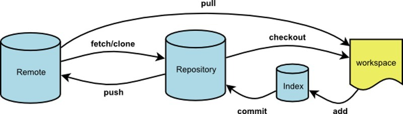

# 一、git初识

git是一个非常好的代码管理工具，在团队开发中被广泛使用，很多人会用一些基本指令，但不明白git的一些概念，这就导致出现一些问题时候会束手无策。

git的代码管理分为三个部分：

- workspace — 本地的工作区，也就是编辑器保存的代码
- Index — 暂存区，git追踪树
- Respository — 本地git仓库
- Remote — 远程git仓库，即线上的仓库（常见的有GitHub、GitLab）

一般操作流程：workspace ==> `git add .`（将左右修改加入到暂存区）==> `git commit -m "提交描述"`（将代码提交到本地仓库） ==> `git push`（将本地仓库代码更新到远程仓库）

# 二、初次使用git操作流程

1. 本地创建公钥 `ssh-keygen -t rsa -C "邮箱"`
2. 添加公钥到线上仓库
3. 克隆最新主分支项目代码 `git clone <项目地址>`
4. 创建本地分支 `git branch <分支名>`
5. 查看本地及远程分支 `git branch -a`
6. 切换分支 `git checkout <要切换到分支名>`（一般未提交无法切换，强制切换`git checkout <分支名> -f` 慎重使用）
7. 开发
8. 将本地分支推送到远程分支 `git push <远程仓库> <本地分支>:<远程分支>`

# 三、指令总结

## 1、git remote
为远程仓库指定别名，以便于管理远程主机，默认只有一个时为origin
- 查看主机名`git remote`
- 查看主机名及地址`git remote -v`
  - 默认克隆远程仓库到本地时，远程主机为origin，如需指定别名可使用`git clone -o <别名> <远程仓库地址>`
- 查看主机的详细信息`git remote show <主机名>`
- 添加远程主机`git remote add <主机名> <网址>`
- 删除远程主机`git remote rm <主机名>`
- 修改远程主机的别名`git remote rename <原主机名> <新主机名>`

## 2、git fetch
将某个远程主机的更新，全部/分支 取回本地（此时只更新了Repository）它取回的代码对本地的开发代码没有影响，如需彻底更新需合并或者使用`git pull`
- 远程仓库更新，全部取回本地`git fetch <远程主机名>`
- 将远程仓库特定分支更新到本地`git fetch <远程主机名> <分支名>`

## 3、git pull
拉取远程主机某分支的更新，**再与本地的指定分支合并**（相当与fetch加上了合并分支功能的操作）
- 拉取远程某分支并与本地某一分支合并（没有则默认会创建）：`git pull <远程主机名> <远程分支名>:<本地分支名>`
- 如果远程分支是与当前所在分支合并，则冒号后面的部分可以省略：`git pull <远程主机名> <远程分支名>`
- 如果当前分支与远程分支存在追踪关系,则可以省略远程分支名：`git pull <远程主机名>`
- 如果当前分支只有一个追踪分支，则远程主机名都可以省略：`git pull`

## 4、git push
将本地分支的更新，推送到远程主机，其命令格式与`git pull`相似
- 将本地分支推送到远程分支：`git push <远程主机名> <本地分支名>:<远程分支名>`
- 如果省略远程分支名，则默认为将本地分支推送到与之关联的远程分支：(一般设置本地分支和与之关联的远程分支同名，防止混淆)`git push <远程主机名> <本地分支名>`
  - 如果对应的远程分支不存在，则会被创建（默认与本地分支同名）
- 如果当前分支与远程分支之间存在追踪关系，则本地分支和远程分支都可以省略`git push origin`
- 如果当前分支只有一个追踪分支，那么主机名也可以省略：`git push`
- 
- 如果省略本地分支名，则表示 **删除** 指定的远程分支，这等同于推送一个空的本地分支到对应远程分支：`git push origin :<远程分支>` 等同于 `git push origin --delete <远程分支>`
- 如果远程主机的版本比本地版本更新，推送时Git会报错，要求先在本地做`git pull`合并差异，然后再推送到远程主机。如果一定要推送，可以使用--force选项(谨慎使用，除非你非常确认)`git push --force origin`
- 
- **注意**: 分支推送顺序的格式为`<来源地>:<目的地>`，所以`git pull`格式：`<远程分支>:<本地分支>`，`git push`格式为：`<本地分支>:<远程分支>`。

## 5、分支操作
- 创建本地分支：`git branch test` (创建名为test的本地分支)
- 切换分支：`git checkout test` (切换到test分支)
- 创建并切换分支`git checkout -b test` (相当于以上两条命令的合并)
- 查看本地分支：`git branch`
- 查看远程仓库所有分支：`git branch -a`
- 删除本地分支：`git branch -d test` (删除本地test分支)
- 分支合并：`git merge master` (将master分支合并到当前分支)
- 本地分支重命名：`git branch -m oldName newName`
- 远程分支重命名：
  1. 重命名远程分支对应的本地分支：`git branch -m oldName newName`
  2. 删除远程分支：`git push --delete origin oldName`
  3. 上传新命名的本地分支：`git push origin newName`
  4. 把修改后的本地分支与远程分支关联：`git branch --set-upstream-to origin/newName`
- 
- 分支关联：
  - 查看当前的本地分支与远程分支的关联关系：`git branch -vv`
  - 把当前本地分支与远程origin的某分支进行关联处理（通过 --set-upstream-to命令）：`git branch --set-upstream-to=origin/feature/clear-server-eslint-error_11`
- 
- 分支差异查看
  - 查看本地当前分支与远程某一分支的差异：`git diff origin/feature/reserve-3.4`
  - 查看本地特定分支与远程分支的差异：`git diff master origin/feature/reserve-3.4`

## 6、修改撤销
- `git checkout -- <文件名>`：丢弃工作区的修改，就是让这个文件回到最近一次`git commit`或`git add`时的状态
- `git reset HEAD <文件名>`：把暂存区的修改撤销掉，重新放回工作区
- `git reset --hard <commit_id>`：git版本回退，回退到特定的commit_id版本
  1. `git log`查看提交历史，以便确定要回退到哪个版本（commit之后的即为commit_id）
  2. `git reset --hard <commit_id>`：回退到commit_id版本

## 7、查看信息
- `git status` 显示有变更的文件
- `git log` 显示当前分支的版本历史
- `git log --stat` 显示commit历史，以及每次commit发生变更的文件
- `git log -S <keyword>` 搜索提交历史，根据关键词
- `git diff --shortstat "@{0 day ago}"` 显示今天你写了多少行代码

# 四、配置
- `git config -l`：列出所有的git配置
- `git config core.ignorecase false`：配置git不忽略大小写（默认忽略）

# 五、团队git开发策略

当一个团队共同开发一个项目的时候，拿到一个需求，一般是这样开发的

以我公司为例，我们的项目托管在gitLab上，每个项目都有online、qa、develop三个分支，分别对应正式环境，预发布环境，测试环境，平时开发在develop分支上拉取分支开发，自测没有问题后merge到qa分支交付产品测试，测试通过后merge到online分支进行上线发布

1. `git clone` 拉取项目代码
2. `git checkout develop` 切换到`develop`分支
3. `git pull` 拉取最新代码
4. `git checkout -b AMSAAS-3` 创建并切换到`AMSAAS-3`分支进行开发
5. `git push origin AMSAAS-3` 创建远程分支`AMSAAS-3`并与本地分支`AMSAAS-3`关联
6. 在`AMSAAS-3`上开发自己的需求，记得多commit、push代码防止出现意外代码丢失
7. 开发完成后 `git checkout develop` 切换到`develop`分支
8. `git merge AMSAAS-3` 将自己的代码合并到`develop`分支
   - 在执行这一步操作的时候，我们经常会遇到冲突这种情况，而且往往要merge的分支自己是没有push权限的，这个时候怎么解决conflict呢？一般会从develop上拉一个专门解冲突的分支，在这分支上解完后再在将这个分支merge到develop上。
   具体操作步骤如下:
   1. `git checkout -b develop-conflict` 创建并切换到`develop-conflict`分支
   2. `git merge AMSAAS-3` 合并分支`AMSAAS-3`
   3. 解冲突，`git add ==> git commit ==> git push`
   4. `git checkout develop` 切换到`develop`分支
   5. `git merge develop-conflict` 将`develop-conflict`分支合并到`develop`上
   6. `git branch -d develop-conflict` 删除本地`develop-conflict`分支
   7. `git push origin --delete develop-conflict` 删除远程`develop-conflict`分支
   - 
   - 有一种错误或者说不推荐的做法是在往develop上合之前，先将develop和到自己分支上，在自己分支解决完冲突在往develop上和，这种方法也能达到目的，但是在开发用分支下，很多人提交到develop上的代码并不一定正确，这样会将所有develop的代码同步到自己分支上，很容易出现一些问题，所以是不推荐的

# 六、开发过程中遇到的bug 